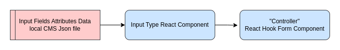

# IEEE AAST Alex SB - Recruitment Form

> volunteering project that is done for the offical IEEE AAST Student Branch, that gave us the oppurtunity to apply learned skills and to be used on ground.

> **Note**: This was the official recruitment form for IEEE AAST ALEX SB in 2022 and it is no longer deployed now, every year the deployed website changes due to teaching purposes.

## Table of Contents

- [Organization's Problem](#organziations-problem)
- [Requirements](#briefrequirements)
- [Solution](#solution)
  - [Plan](#plan)
  - [Implementation](#implementation)
  - [Solution Power Points](#solution-power-points)
  - [Solution Pitfalls](#solution-pitfalls)
- [What is IEEE?](#what-is-ieee)

---

## Organziation's Problem

- They wanted a custom developed recruitment form that will be used by more than 150 student to be a good interface of a technical student branch.
- Tens of input fields are required to be field with a specific criteria.

## Brief/Requirements

- Follow a specific design that it's main aim is to provide good user experience navigating between form pages
- Reusability as Input fields may be updated or changed by team members.

## Solution

### Plan

One of the main cards in this plan is to use the power of the most powerful React.js form validation library which is "React Hook From", so the challenge was in the flow of data before usage of that library, and here is data flow diagram to explain how it works under the hood.

<p align="center">
    
</p>

[Back To The Top](#table-of-contents)

### Implementation

1. Example of data that is stored local CMS json file

```js
    {
        type: "text",
        fieldLabel: "Phone number",
        stateName: "phoneNumber",
        pattern: /^[0][1-9]\d{9}$|^[1-9]\d{9}$/g,
        patternErrMsg: "Write a valid phone number (11 digits)",
    },
```

2. In this second stage, there should exist React.js component for each input fields type to handle it's styles and logic

```js
import React from "react";

export default InputField = (props) => {
  return (
    <input
      className="inputField"
      name={props.name}
      onChange={(e) => {
        props.onChange && props.onChange(e);
        props.setData({ ...props.data, [props.name]: e.target.value });
      }}
      value={props.data[props.name]}
    />
  );
};
```

3. The third and the last stage is the UI rendering function using `Controller` Reach Hook Form Component

```js
if (item.type === "text") {
  return (
    <div key={i} className="fieldContainer">
      <div className="fieldLabel">{item.fieldLabel}</div>
      <Controller
        {...{
          control,
          register,
          name: item.stateName,
          rules: {
            required: "This field is required",
            pattern: {
              value: item.pattern,
              message: item.patternErrMsg,
            },
          },
          render: (props) => (
            <InputField {...props} data={data} setData={setData} />
          ),
        }}
      />
      <ValidationErrorMessage errors={errors} item={item} />
    </div>
  );
}
```

[Back To The Top](#table-of-contents)

### Solution Power Points

- Reusability (just use the styled and logic handled components for editing or adding new fields)
- pixel perfect design!
- Documentation (documentation makes it able to be maintained by other team members)
- Clean and readable code

[Back To The Top](#table-of-contents)

### Solution Pitfalls

The usage of generic `useState` trying to implement "Configuration Object" pattern that carries the state of all input fields which will cause rerender every time the state is updated, and the right approach here is to use atomic state instead to be responsible of rendering a single component only not the whole page.

[Back To The Top](#table-of-contents)

## What is IEEE?

IEEE and its members inspire a global community to innovate for a better tomorrow through highly cited publications, conferences, technology standards, and professional and educational activities. IEEE is the trusted “voice” for engineering, computing, and technology information around the globe.

Refrence: https://www.ieee.org/about/index.html

<p align="center">
    
    
</p>

[Back To The Top](#table-of-contents)
